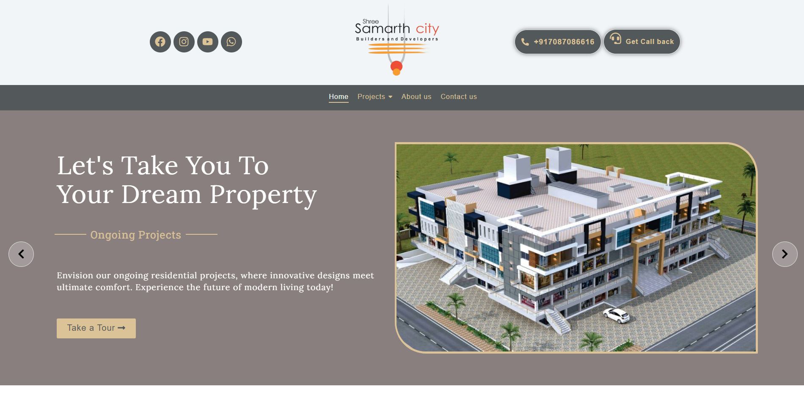

# Shree Samarth City

**Client:** Shree Samarth City  
**Sector:** Real Estate  
**Website:** [shreesamarthcity.in](https://shreesamarthcity.in)  
**Location:** Dharashiv City, Maharashtra  
**Project Type:** Real Estate Business Website  
**Technology Stack:** PHP, MySQL, WordPress, WooCommerce, Elementor, Astra Theme  

---

### 📚 **Overview**

Established in 2013, **Shree Samarth City** is a trusted name in affordable housing within Dharashiv City. Known for its commitment to building a better tomorrow, the company required a modern online platform to showcase both current and upcoming real estate ventures.

Smartscripts was brought on board to craft a digital presence that would reflect the company’s vision, simplify property discovery, and foster trust among potential homebuyers in the region.

---
### 🎯 **Objectives**

- Design a user-friendly and visually appealing website
    
- Promote active and upcoming housing schemes
    
- Enable seamless inquiries and customer communication
    
- Strengthen online visibility locally and regionally

---
### 🚧 **Challenges**

- **Limited Digital Presence:** No prior website or digital footprint
    
- **Information Organization:** Property details needed structured, easy navigation
    
- **Mobile Accessibility:** The site had to perform flawlessly across all devices
    
- **Brand Messaging:** The digital experience had to reflect the brand’s core values — trust, affordability, and community

---
### 💡 **Our Solution**

We delivered a clean, mobile-responsive real estate website using **WordPress**, **Elementor**, and the **Astra theme**, offering both performance and ease of content management.

 **Key Features Implemented:**

- **Project Listing Pages:** Structured layouts with summaries, galleries, key amenities, and Google Maps integration
    
- **WooCommerce Integration:** Repurposed for organizing property categories and streamlining listing management
    
- **Lead Generation Forms:** Intuitively placed contact forms on each project page
    
- **Responsive Design:** Optimized for smooth user experience across all devices
    
- **SEO-Ready Build:** Proper heading hierarchy, performance tuning, and keyword-ready structure for better search rankings

---
### 📈 **Results**

✅ **Improved Online Presence:** A credible, informative, and professional website now represents the brand online  
✅ **More Inquiries:** Clearer content and prominent forms led to a noticeable increase in buyer engagement  
✅ **Enhanced User Experience:** Visitors can quickly explore property details and easily find contact options  
✅ **Mobile Optimization:** Users on mobile and tablets reported seamless navigation and improved experience

---
### **Client Feedback**

> _"Smartscripts enabled us to put our vision onto the web with an elegant and informative website. The team was highly responsive and had an excellent understanding of our requirements. Now, our customers can instantly search for project information online and reach out to us promptly."_  
> — **Shree Samarth City Team**
